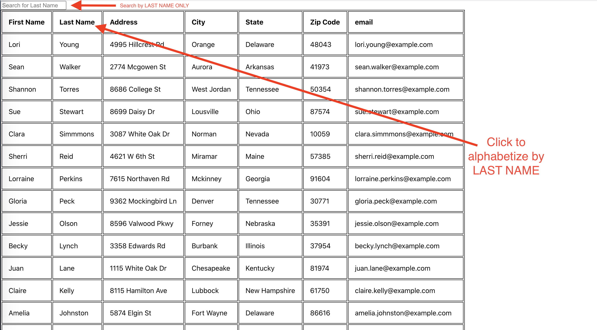

# User-Directory

## Description 

This React JS application allows the user to search for people in the table by last name only. The user can also organize the table alphabetically by people's last name. 

To organize the table by last name, the user simply has to click on "Last Name" at the top of the last name column. The last names will toggle between A to Z and Z to A. 

## Technologies

* React  
* Axios

## Links

Github Repo: https://github.com/elock721/User-Directory

Github Pages Deployment: https://elock721.github.io/User-Directory/

## Screenshots

